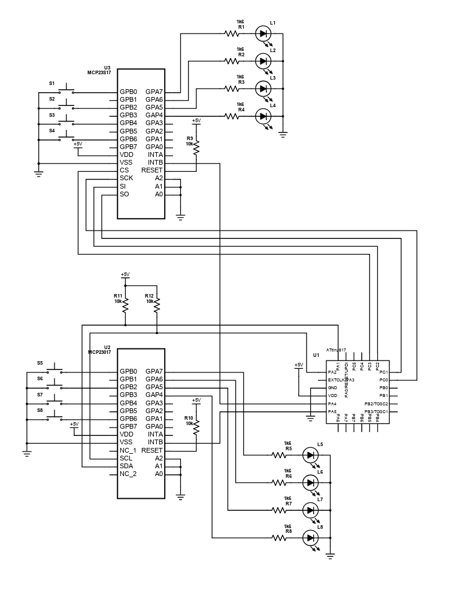

# Comms_tests
Personal project to brush up/re-learn C and embedded software.

## Setup
Setup consists of a single microcontroller connected to two I/O expanders, with each I/O expander connected in turn to a set of LEDS and push-buttons.
The microcontroller communicates to the other devices via SPI and I2C, and also monitors two interrupts, one from each of the I/O expanders.

## Hardware

1 [ATtiny Xplained Mini Evaluation board](https://www.microchip.com/DevelopmentTools/ProductDetails/PartNO/ATTINY817-XMINI) ([ATtiny817](https://www.microchip.com/wwwproducts/en/ATTINY817) processor)
2 [MCP23017](https://www.microchip.com/wwwproducts/en/MCP23017) I2C I/O expander
3 [MCP23S17](https://www.microchip.com/wwwproducts/en/MCP23017) SPI I/O expander

## Software Tools

* [Atmel Studio 7](https://www.microchip.com/mplab/avr-support/atmel-studio-7)
* [git](https://git-scm.com/)

## Status
Incomplete. Basic read/write functions and interrupts work, however there is no buffering/message queuing as yet. Essentially interrupts are missed if the associated comms channel is busy.

## Notes

* Atmel I2C drivers used as reference, this is a much more simplistic implementation
* No message queuing/buffering for I2C or SPI yet
* SPI peripheral running in unbuffered mode
* I2C restart condition not yet implemented

## Authors

* Me
